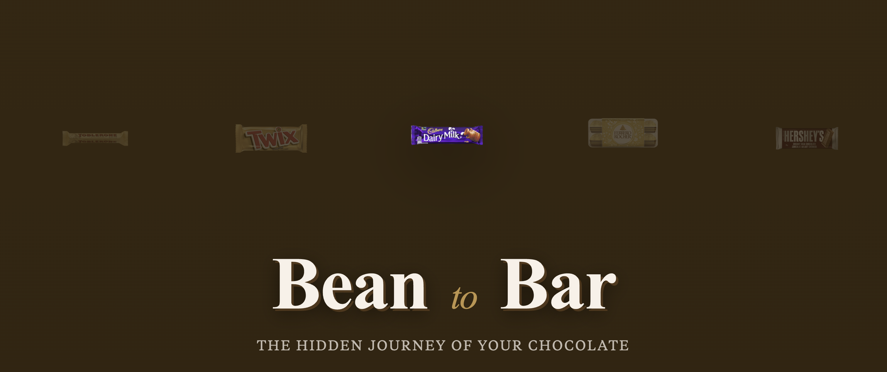

# Bean to Bar



An interactive data visualization exploring the hidden journey of your chocolate — from cocoa farms in West Africa to the corporate empires behind your favorite candy bars.

## About

**Bean to Bar** tells the story of chocolate through data. Discover who really owns the brands you love, follow the journey from cocoa pod to wrapped bar, explore global production patterns, and understand the economic realities facing cocoa farmers.

### Features

- **Interactive chocolate selection** — Pick your favorite bar and follow its story
- **Corporate ownership visualization** — See how a handful of conglomerates control most chocolate brands
- **Bean to bar journey** — Swipe through the chocolate-making process with illustrated and real-world photos
- **Global cocoa production map** — Explore which countries produce the world's cocoa
- **Income breakdown** — Understand how little of your chocolate bar's price reaches farmers
- **Environmental impact** — Visualize tree cover loss in Ghana's cocoa-growing regions

## Getting Started

### Prerequisites

- [Node.js](https://nodejs.org/) >= 18.20.4
- npm or pnpm

### Installation

1. Clone the repository:
```bash
git clone https://github.com/yourusername/bean-to-bar.git
cd bean-to-bar
```

2. Install dependencies:
```bash
npm install
```

### Development

Start the development server:
```bash
npm run dev
```

The app will be available at `http://localhost:5173`

### Build

Create a production build:
```bash
npm run build
```

Preview the production build:
```bash
npm run preview
```

## Tech Stack

### Framework
- **[SvelteKit](https://kit.svelte.dev/)** — Full-stack web framework
- **[Svelte 5](https://svelte.dev/)** — Component framework with runes

### Visualization & UI
- **[D3.js](https://d3js.org/)** — Data manipulation and visualization utilities
- **[Chart.js](https://www.chartjs.org/)** — Charting library for environmental data visualizations
- **[Swiper](https://swiperjs.com/)** — Touch slider for the bean-to-bar journey
- **[Lucide Icons](https://lucide.dev/)** — SVG icon library

### Styling
- **CSS Custom Properties** — Chocolate-themed design tokens
- **PostCSS + Autoprefixer** — CSS processing

### Data
- **[TopoJSON](https://github.com/topojson/topojson)** — Geographic data for maps

## Data Sources

- **[FAOSTAT](https://www.fao.org/faostat/en/#data/QCL)** — Cocoa production statistics
- **[Global Forest Watch](https://www.globalforestwatch.org/dashboards/country/GHA/)** — Ghana tree cover loss data
- **[Observatory of Economic Complexity](https://oec.world)** — Cocoa trade data
- **[Chocolate Scorecard](https://www.chocolatescorecard.com/scorecards)** — Industry ethical practices

## Project Structure

```
bean-to-bar/
├── src/
│   ├── components/       # Svelte components
│   │   ├── Index.svelte          # Main app entry
│   │   ├── TitlePage.svelte      # Landing page with animated carousel
│   │   ├── Intro.svelte          # Chocolate bar selection
│   │   ├── ChocolateScrollyStory.svelte  # Main story container
│   │   ├── ChocolateShelf.svelte # Corporate ownership shelf
│   │   ├── CocoaStepsSwiper.svelte # Bean to bar journey
│   │   ├── CocoaProducers.svelte # Production bubble chart
│   │   ├── ChocolateIncomeShare.svelte # Income breakdown
│   │   ├── GhanaTreeImpact.svelte # Environmental charts
│   │   └── Footer.svelte         # Site footer
│   ├── data/             # JSON data files
│   ├── styles/           # Global CSS
│   └── routes/           # SvelteKit routes
├── static/
│   └── assets/           # Images and static files
└── package.json
```

## Team

- **Nhaomi** — Favorite chocolate: Cadbury
- **Richael** — Favorite chocolate: Kinder Eggs
- **Wini** — Favorite chocolate: Twix

## License

This project was created for educational purposes to raise awareness about the chocolate industry's impact on cocoa farmers and the environment.

---

*Created with care for cocoa farmers everywhere.*
