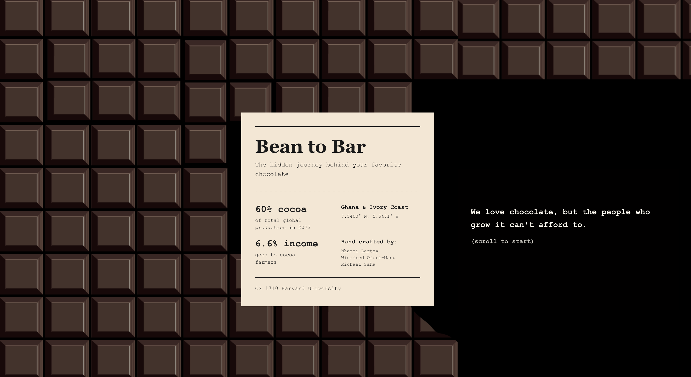
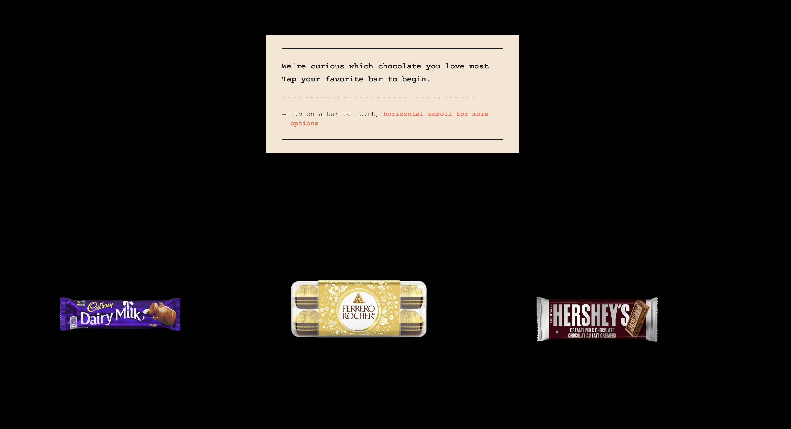
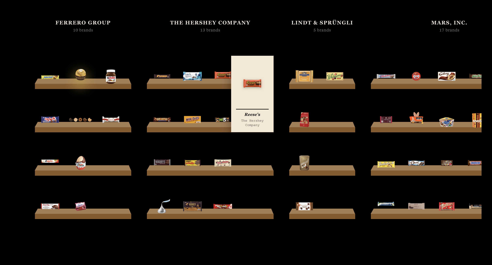
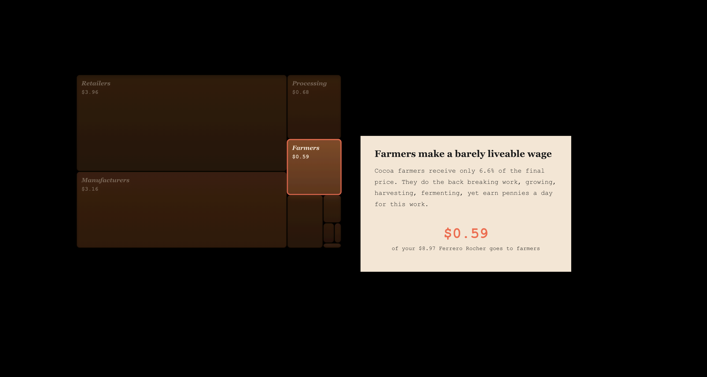
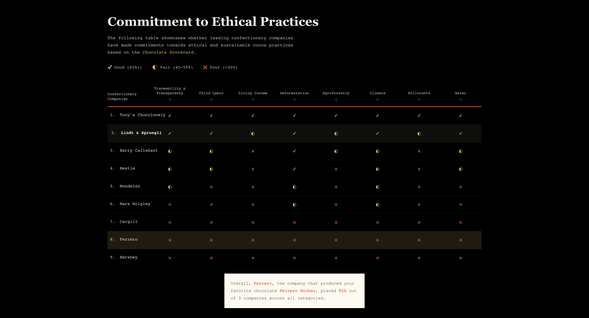

# Bean to Bar

**The Hidden Journey Behind Your Favorite Chocolate**

> CS 1710 Data Visualization Project at Harvard University
> By Nhaomi Lartey, Winifred Ofori-Manu, and Richael Saka

[Project Link](https://richaelsaka.github.io/bean-to-bar/)

## Table of Contents

- [Abstract](#abstract)
- [Treatment](#treatment)
- [Data Sources](#data-sources)
- [Design Decisions](#design-decisions)
- [Conclusion](#conclusion)
- [Screen Captures](#screen-captures)
- [Tech Stack](#tech-stack)
- [Acknowledgements](#acknowledgements)

## Abstract

*Bean to Bar* aims to visualize the hidden journey of chocolate — from cocoa farms in West Africa to the corporate empires behind your favorite candy bars. We love chocolate, but the people who grow it can't afford to.

By drawing attention to the economics and environmental impact of cocoa production, our project reveals the bittersweet reality behind each pound of chocolate. Through interactive visualizations, users discover who really owns the brands they love, follow the journey from cocoa pod to wrapped bar, explore global production patterns, and understand the economic realities facing cocoa farmers who receive only 6.6% of the final price.



## Treatment

    - I. Who Owns Your Favorite Bar?
    - II. From Bean to Bar
    - III. The Scale of Production
    - IV. Global Cocoa Production
    - V. The Cost of Cocoa
    - VI. Environmental Impact
    - VII. What Can We Do?

Inspired by the scrollytelling genre of data visualization, this project guides audiences through the chocolate supply chain at their own pace. Scroll-based transitions lead users through sections while visualizations automatically synchronize with descriptive contexts.

Our target audience is everyday chocolate consumers who may not be aware of the industry's impact on farmers and the environment. By presenting data in an accessible, interactive format, we aim to transform a guilty pleasure into informed consumption.

The project is structured around the journey of a single chocolate bar — from the user's selection to the broader implications of their purchase. This personal framing helps users connect abstract statistics to their own choices.

## Data Sources

The fundamental purpose of this study is to illuminate the disconnect between chocolate consumption and cocoa farmer livelihoods, while examining the environmental cost of production.

Datasets used in this project were collected from governmental and non-profit organizations dedicated to environment study, forests' monitoring, and cocoa industry research.

| Data | Source |
|--|--|
| Global Cocoa Production Statistics | [FAOSTAT (Food and Agriculture Organization)](https://www.fao.org/faostat/en/#data/QCL) |
| Ghana Tree Cover Loss Data | [Global Forest Watch](https://www.globalforestwatch.org/dashboards/country/GHA/) |
| Cocoa Trade Data | [The Observatory of Economic Complexity](https://oec.world/en/profile/bilateral-product/cocoa-beans/reporter/gha) |
| Industry Ethical Practices | [Chocolate Scorecard](https://www.chocolatescorecard.com/scorecards) |
| Cocoa Industry Statistics | [International Cocoa Organization (ICCO)](https://www.icco.org/) |
| Sustainability Research | [World Cocoa Foundation](https://www.worldcocoafoundation.org/) |
| Deforestation Monitoring | [Mighty Earth](https://www.mightyearth.org/) |

## Design Decisions

This project went through extensive ideation, prototyping, data cleaning, and iteration. We used SvelteKit and D3.js as our primary tools, creating custom visualizations that respond to user interaction.

Users land on a title page styled like a chocolate bar wrapper, immediately establishing the visual metaphor that carries through the project. The cream-colored cards against a dark background evoke the contrast between chocolate and its packaging.

Key design decisions include:

- **Interactive chocolate selection** — Users pick their favorite bar, making the story personal from the start
- **Corporate ownership shelf** — A horizontally-scrollable shelf reveals how few companies control most brands
- **Treemap income breakdown** — Visualizes how little of the purchase price reaches farmers
- **Waffle chart production** — Each square represents 1,000 tons of cocoa, making scale tangible
- **Tree cover loss visualization** — Charts Ghana's deforestation alongside cocoa production growth

At the end of each section, highlighted takeaways summarize key insights, while transition cards prepare users for what comes next.

## Conclusion

The chocolate industry presents a paradox: a $130 billion global market built on the labor of farmers who earn less than $2 per day. While 60% of the world's cocoa comes from Ghana and Ivory Coast, the farmers there receive only 6.6% of the final chocolate bar's price.

This economic pressure drives deforestation as farmers clear more land to increase yields. Ghana has lost significant tree cover in cocoa-growing regions, contributing to climate change and biodiversity loss.

However, change is possible. By supporting companies committed to ethical sourcing, looking for certifications like Fair Trade and Rainforest Alliance, and simply being aware of where our chocolate comes from, consumers can drive industry transformation.

Our hope is that *Bean to Bar* transforms chocolate from a mindless indulgence into an opportunity for conscious consumption.

## Screen Captures










## Tech Stack

### Framework
| Technology | Purpose |
|--|--|
| [SvelteKit](https://kit.svelte.dev/) | Full-stack web framework for routing and SSR |
| [Svelte 5](https://svelte.dev/) | Component framework with runes for reactive state management |

### Visualization & Interaction
| Technology | Purpose |
|--|--|
| [D3.js](https://d3js.org/) | Data manipulation, scales, and custom visualizations |
| [Swiper](https://swiperjs.com/) | Touch-enabled slider for the bean-to-bar journey |
| [TopoJSON](https://github.com/topojson/topojson) | Geographic data for world map visualizations |
| [Lucide Icons](https://lucide.dev/) | SVG icon library |

### Styling
| Technology | Purpose |
|--|--|
| CSS Custom Properties | Design tokens for chocolate-themed color palette |
| PostCSS + Autoprefixer | CSS processing and browser compatibility |

### Data Processing
| Technology | Purpose |
|--|--|
| JSON | Static data files for chocolate ownership and production statistics |
| CSV | Raw data from FAOSTAT and other sources |

## Getting Started

```bash
# Clone the repository
git clone https://github.com/richaelsaka/bean-to-bar.git
cd bean-to-bar

# Install dependencies
npm install

# Start development server
npm run dev

# Build for production
npm run build
```

## Acknowledgements

*Bean to Bar* was created by Nhaomi Lartey, Winifred Ofori-Manu, and Richael Saka for CS 1710 at Harvard University.

Special thanks to **Professor Hanspiter**, our wonderful teaching staff, and our TF **Richard** for their guidance and support throughout this project.

---

*We love chocolate, but the people who grow it can't afford to.*
